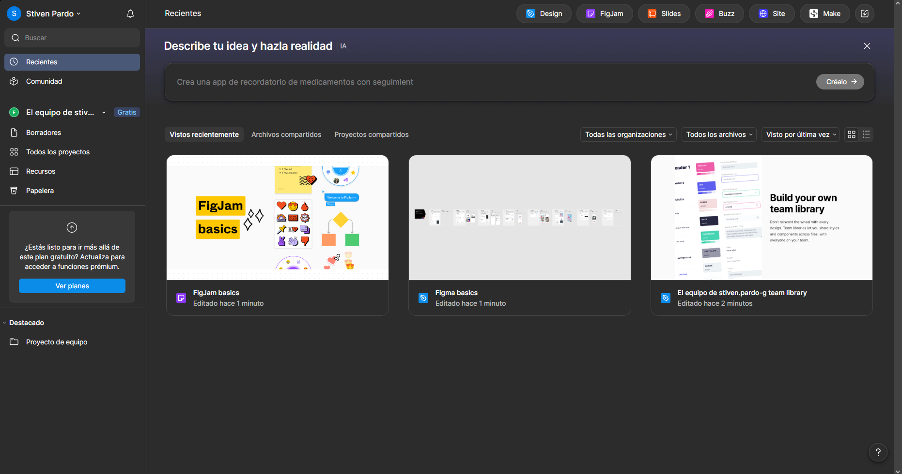
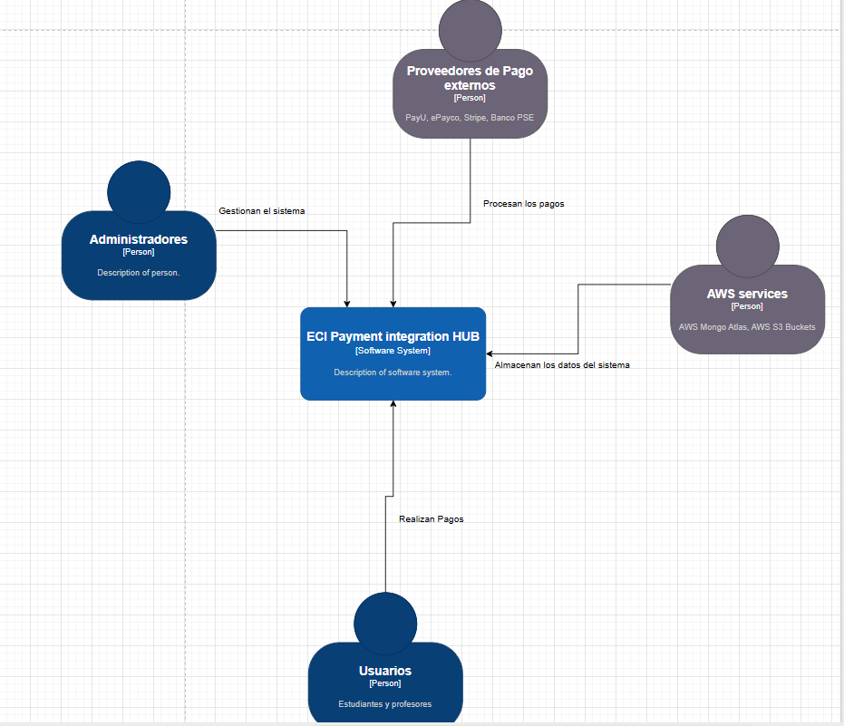

# DOSW_ParcialT1_StivenPardo

#STIVEN ESNEIDER PARDO GUTIERREZ, GRUPO 2

Evidencia de cuenta figma creada correctamente 
 

1. Realice el diagrama de contexto con las generalidades de su sistema.
(Añadirlo al README.md)
    Diagrama de contexto
    
    en el diagrama de contexto identificamos como es que cada uno de los actores interactuan entre si para el correcto funcionamiento del sistema

2. Identifique 2 patrones de diseño que puedan aplicarse al caso de estudio,
especificando por cada uno:
a. Nombre del Patrón
b. Tipo de patrón (creacional, estructural o de comportamiento).
c. Justificación de la decisión.

    1. Patrón: Adapter
        Tipo de patrón: Estructural
        Justificación: Cada proveedor de pago (PayU, ePayco, Stripe, Banco PSE) tiene su propia API y formato de datos. El patrón Adapter permite que estas interfaces incompatibles trabajen con el sistema ECI sin modificar el código de los proveedores externos. Esto es esencial para unificar las respuestas en el formato institucional requerido y garantizar que el sistema interno no dependa de ninguna implementación específica de proveedor.
        
    2. Patrón: Abstract Factory
        Tipo de patrón: Creacional
        Justificación: El sistema debe crear diferentes objetos de proveedores según las reglas de negocio específicas (USD solo con Stripe, PSE solo con Banco PSE, etc.). Abstract Factory permite crear familias de objetos relacionados (procesadores de pago) sin especificar las clases concretas, respetando las restricciones del caso de estudio. Además, facilita agregar nuevos proveedores en el futuro sin modificar el código existente, cumpliendo con el principio abierto/cerrado.

3. Identifique 5 requerimientos del sistema y clasifíquelos en funcionales (3) y
no funcionales (2). Garantice que al menos un requerimiento funcional
seleccionado utilice uno o los dos patrones identificados. (Añadirlo al
README.md)

    Requerimientos Funcionales:

        Centralización de Proveedores de Pago:
        Tenemos que el sistema debe dejar gestiuonar los pagos online para los servicios institucionales (bootcamps, certificados academicos, eventos, etc.) se debe de usar un unico sistema centralizado.

        Relación con el Patrón: 
        Utiliza el patrón Strategy para permitir cambiar de proveedor de pago sin modificar el código principal.

        Validación de Pagos:
        Solo se deben aceptar pagos mayores a $5,000 COP y correos institucionales terminados en @escuelaing.edu.co o @mail.escuelaing.edu.co.

        Unificación de Respuestas:
        El sistema debe unificar las respuestas de los proveedores en un formato único institucional, ignorando campos adicionales y devolviendo "PENDIENTE" en caso de fallos.

    2. Patrón: Abstract Factory
        Tipo de patrón: Creacional
        Justificación: El sistema debe crear diferentes objetos de proveedores según las reglas de negocio específicas (USD solo con Stripe, PSE solo con Banco PSE, etc.). Abstract Factory permite crear familias de objetos relacionados (procesadores de pago) sin especificar las clases concretas, respetando las restricciones del caso de estudio. Además, facilita agregar nuevos proveedores en el futuro sin modificar el código existente, cumpliendo con el principio abierto/cerrado.

3. Identifique 5 requerimientos del sistema y clasifíquelos en funcionales (3) y
no funcionales (2). Garantice que al menos un requerimiento funcional
seleccionado utilice uno o los dos patrones identificados. (Añadirlo al
README.md)

    Requerimientos Funcionales:

        1. Integración Unificada de Múltiples Proveedores de Pago:
            El sistema debe integrar diferentes proveedores de pago (PayU, ePayco, Stripe, Banco PSE) que tienen APIs y formatos de respuesta distintos, unificándolos bajo una interfaz común para el sistema ECI.
            Relación con el Patrón: Utiliza el patrón Adapter para convertir las interfaces incompatibles de cada proveedor a una interfaz unificada que entienda el sistema interno.

        2. Selección Automática de Proveedor según Reglas de Negocio:
            El sistema debe crear automáticamente el proveedor de pago correcto basándose en las restricciones del negocio (USD solo con Stripe, PSE solo con Banco PSE, otros medios con PayU o ePayco).
            Relación con el Patrón: Utiliza el patrón Abstract Factory para crear la familia correcta de objetos procesadores de pago según las reglas establecidas.

        3. Validación de Datos de Pago:
            Solo se deben aceptar pagos mayores a $5,000 COP y correos institucionales terminados en @escuelaing.edu.co o @mail.escuelaing.edu.co.

    Requerimientos No Funcionales:

        Rendimiento:
        El sistema debe responder en un máximo de 3 segundos para el 95% de las transacciones y soportar 200 pagos concurrentes.

        Diseño de Interfaz:
        La aplicación web debe ser responsive, usar los colores institucionales (naranja y rosado) y la tipografía Poppins.

        La aplicación web debe ser responsive, usar los colores institucionales (naranja y rosado) y la tipografía Poppins.

Del listado anterior, seleccione los 2 requerimientos funcionales más importantes del sistema y desarrolle un diagrama de casos de uso con su
respectiva historia de usuario. Garantiza que al menos un requerimiento funcional seleccionado utilice un patrón identificado. 

    Los dos mas importantes son: Procesar pago institucional y Gestionar multiples proveedores de pago
    
    Diagramas de casos de uso:
    

    Historia de Usuario para el procesamiento de los pagos 
        El usuario ingresa sus datos de pago
        El sistema valida el correo institucional y monto mínimo
        El sistema selecciona automáticamente el proveedor según las reglas (Abstract Factory)
        El sistema adapta la solicitud al formato del proveedor seleccionado (Adapter)
        Se procesa el pago y se retorna respuesta unificada

    Historia de Usuario para la gestion de diferentes proveedores de pago:
    El administrador configura un nuevo proveedor
    El sistema crea el adapter correspondiente para el nuevo proveedor
    La factory se actualiza para incluir las reglas del nuevo proveedor
    El sistema continúa funcionando sin modificar el código existente

5. Especifique los 2 requerimientos funcionales seleccionados en el punto anterior, siguiendo la plantilla de Análisis de requerimientos.
Nota: No es necesario que especifique ni la sección de prototipo, ni las
abreviaturas e historial de revisión.

    Análisis de Requerimientos - ECI Payment Integration Hub
    RF-001: Procesar Pago Institucional
    Identificación del Requerimiento
    ID: RF-001
    Nombre: Procesar Pago Institucional
    Prioridad: Alta
    Tipo: Funcional
    Descripción
    El sistema debe permitir a los usuarios institucionales realizar pagos en línea para servicios académicos (bootcamps, certificados, eventos, cursos) validando datos institucionales y procesando el pago a través del proveedor correspondiente según las reglas de negocio establecidas.

    Actores
    Actor Principal: Estudiante/Usuario Institucional
    Actores Secundarios: Sistema de Proveedores de Pago, Base de Datos MongoDB Atlas
    Precondiciones
    El usuario debe tener un correo institucional válido (@escuelaing.edu.co o @mail.escuelaing.edu.co)
    El monto del pago debe ser mayor a $5,000 COP
    Los proveedores de pago deben estar disponibles

    Postcondiciones
    El pago es procesado exitosamente
    Se genera un registro en la base de datos
    Se retorna una respuesta en formato unificado institucional

    Flujo Principal
    El usuario ingresa información de pago (nombre, documento, correo, concepto, monto, moneda, medio de pago)
    El sistema valida que el correo termine en dominio institucional
    El sistema valida que el monto sea mayor a $5,000 COP
    El sistema selecciona automáticamente el proveedor usando Abstract Factory
    El sistema adapta la solicitud al formato del proveedor usando Adapter
    Se envía la solicitud al proveedor de pago
    El sistema unifica la respuesta al formato institucional
    Se almacena el registro del pago en MongoDB Atlas

    Flujos Alternativos
    FA-001: Si el correo no es institucional, mostrar error de validación
    FA-002: Si el monto es menor a $5,000 COP, rechazar transacción
    FA-003: Si el proveedor falla, retornar estado "PENDIENTE"

    Excepciones
    E-001: Error de conectividad con proveedor de pago
    E-002: Error de validación de datos de entrada
    E-003: Timeout en respuesta del proveedor (>3 segundos)
    RF-002: Gestionar Múltiples Proveedores de Pago

    Identificación del Requerimiento
    ID: RF-002
    Nombre: Gestionar Múltiples Proveedores de Pago
    Prioridad: Alta
    Tipo: Funcional
    Descripción
    El sistema debe integrar múltiples proveedores de pago (PayU, ePayco, Stripe, Banco PSE) con APIs diferentes, adaptándolos a una interfaz unificada que permita intercambiar proveedores sin modificar el código principal del sistema.

    Actores
    Actor Principal: Sistema ECI Payment Hub
    Actores Secundarios: PayU API, ePayco API, Stripe API, Banco PSE API

    Precondiciones
    Los proveedores de pago deben tener APIs activas
    Las credenciales de cada proveedor deben estar configuradas
    Las reglas de negocio deben estar definidas (USD→Stripe, PSE→Banco PSE)

    Postcondiciones
    La solicitud es procesada por el proveedor correcto
    La respuesta es unificada al formato institucional
    El sistema mantiene independencia de implementaciones específicas

    Flujo Principal
    El sistema recibe una solicitud de pago procesada
    El sistema determina el proveedor usando las reglas de negocio (Abstract Factory)
    Se crea el adapter correspondiente para el proveedor seleccionado
    El adapter convierte la solicitud al formato específico del proveedor
    Se envía la solicitud al API del proveedor
    El adapter recibe la respuesta del proveedor
    El adapter convierte la respuesta al formato unificado institucional
    Se retorna la respuesta unificada

    Flujos Alternativos
    FA-001: Si es moneda USD, usar obligatoriamente Stripe
    FA-002: Si el medio de pago es PSE, usar obligatoriamente Banco PSE
    FA-003: Para otros casos, seleccionar entre PayU o ePayco
    
    Excepciones
    E-001: Proveedor no disponible temporalmente
    E-002: Error en conversión de formatos
    E-003: Respuesta del proveedor en formato no esperado
